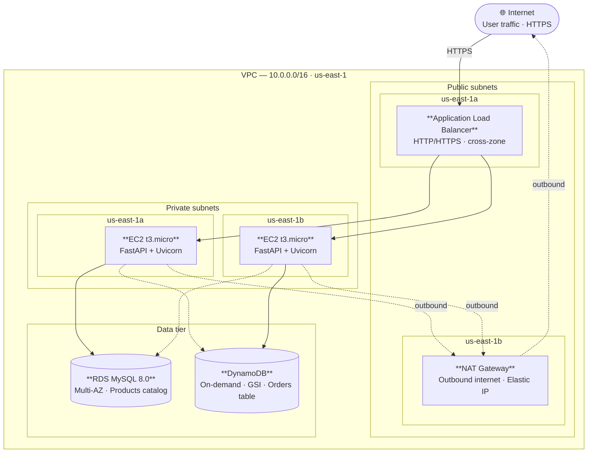

# AWS Cloud E-Commerce Platform

A production-style e-commerce backend deployed on AWS, built to demonstrate cloud architecture design, Infrastructure as Code, and load-tested API performance.

---

## Architecture Overview



> Solid arrows = primary request path · Dashed arrows = outbound egress (NAT) or cross-zone reads
>
> 📐 Full editable diagram: [`docs/aws-ecommerce-architecture.drawio`](docs/aws-ecommerce-architecture.drawio)

Private EC2 instances reach the internet (for OS updates / pip installs) via a NAT Gateway placed in a public subnet.

---

## Tech Stack

| Layer | Technology | Purpose |
|---|---|---|
| Infrastructure | Terraform | All AWS resources managed as code |
| Network | VPC, public/private subnets, NAT Gateway | Network isolation |
| Compute | EC2 t3.micro × 2 | Application servers |
| Load Balancer | Application Load Balancer | Traffic distribution, health checks |
| Relational DB | RDS MySQL 8.0 Multi-AZ | Product catalogue |
| NoSQL DB | DynamoDB (on-demand) | Order storage |
| API | FastAPI + Uvicorn | REST endpoints |
| IAM | EC2 Instance Profile | Least-privilege access to DynamoDB/SSM |
| Load Testing | Locust | Performance validation |

---

## API Endpoints

| Method | Path | Description | Storage |
|---|---|---|---|
| GET | `/health` | ALB health check | — |
| GET | `/products` | List all products | RDS MySQL |
| POST | `/products` | Create a product | RDS MySQL |
| GET | `/products/{id}` | Get a product by ID | RDS MySQL |
| POST | `/orders` | Place an order | DynamoDB |
| GET | `/orders/{user_id}` | Get orders by user | DynamoDB GSI |

Interactive API docs available at `http://<ALB_DNS>/docs` after deployment.

---

## Design Decisions

**Why RDS MySQL with Multi-AZ?**
Product data is relational and benefits from ACID transactions. Multi-AZ provides automatic failover to a standby replica in a second Availability Zone, giving ~99.95% availability with zero manual intervention.

**Why DynamoDB for orders?**
Orders are write-heavy and have a flexible schema (each order can contain a variable number of items). DynamoDB's on-demand billing means no idle cost, and it scales to millions of writes per second without capacity planning.

**Why a private subnet for EC2 and RDS?**
The principle of least privilege. Neither the application servers nor the database should be directly reachable from the internet. All inbound traffic flows through the ALB and is filtered by Security Groups.

**Why Terraform?**
All 21 resources can be created with `terraform apply` and destroyed with `terraform destroy`. This makes cost control trivial — spin up for a demo, destroy immediately after.

---

## Load Test Results

50 concurrent users, ~3 minutes duration.

| Metric | Value |
|---|---|
| Total requests | 3,315 |
| Requests/sec (RPS) | ~22 |
| Failure rate | **0%** |
| Median response time | 100 ms |
| 95th percentile | 470 ms |
| Peak response time | 698 ms |

---

## Project Structure

```
ecommerce-aws/
├── app/
│   ├── main.py              # FastAPI application
│   └── requirements.txt     # Python dependencies
├── tests/
│   ├── test_api.py          # Functional smoke tests
│   └── locustfile.py        # Locust load test
├── main.tf                  # Terraform provider + VPC data sources
├── variables.tf             # Input variable declarations
├── outputs.tf               # Output values (ALB DNS, DB endpoint, etc.)
├── aurora.tf                # RDS MySQL instance + subnet group
├── compute.tf               # EC2, ALB, NAT Gateway, IAM role
├── dynamodb.tf              # DynamoDB orders table + GSI
├── security_groups.tf       # Three-tier security group model
├── terraform.tfvars.example # Template — copy to terraform.tfvars
└── .gitignore               # Excludes secrets and state files
```

---

## Prerequisites

- AWS account with IAM user credentials configured (`aws configure`)
- Terraform >= 1.0
- Python >= 3.8 (for local testing)
- An EC2 Key Pair named `ecommerce-key` in `us-east-1`
- A VPC with public and private subnets tagged `ecommerce-vpc-vpc`

---

## Deployment

```bash
# 1. Clone the repository
git clone https://github.com/<your-username>/ecommerce-aws.git
cd ecommerce-aws

# 2. Create your variable file
cp terraform.tfvars.example terraform.tfvars
# Edit terraform.tfvars and set db_password

# 3. Initialise Terraform
terraform init

# 4. Preview changes
terraform plan

# 5. Deploy (takes ~10–15 minutes — RDS Multi-AZ is the slowest step)
terraform apply

# 6. Test the API
pip install requests locust
python tests/test_api.py

# 7. Run load test
locust -f tests/locustfile.py --host=http://<ALB_DNS_from_output>
# Open http://localhost:8089

# 8. Destroy all resources when done
terraform destroy
```

---

## Cost Estimate (demo run)

| Resource | Cost |
|---|---|
| NAT Gateway | ~$0.045/hr |
| RDS MySQL Multi-AZ (db.t3.micro) | ~$0.034/hr |
| EC2 t3.micro × 2 | ~$0.021/hr |
| ALB | ~$0.018/hr |
| DynamoDB (on-demand) | ~$0.00 idle |
| **Total** | **~$3–4/day** |

A typical demo run (deploy → test → destroy in 2–3 hours) costs less than **$1 USD**.

---

## Security Notes

- `terraform.tfvars` (contains DB password) is git-ignored — never commit it.
- `ecommerce-key.pem` (SSH private key) is git-ignored.
- RDS is not publicly accessible; only EC2 instances in the same VPC can connect.
- SSH port 22 on EC2 is open for demo convenience — restrict to a bastion host IP in production.