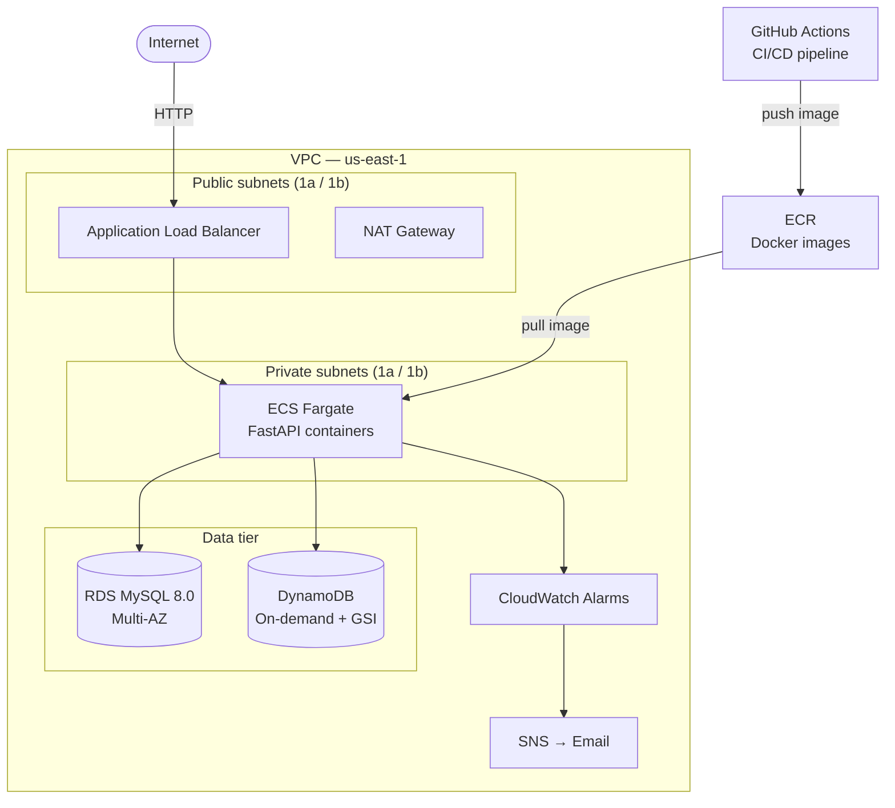
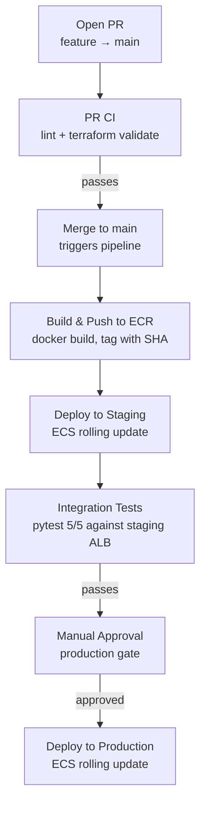

# AWS Cloud E-Commerce Platform

A production-style e-commerce backend on AWS, built to demonstrate end-to-end cloud architecture design, Infrastructure as Code, CI/CD automation, and observability. Designed as a portfolio project for Solution Architect interviews.

---

## Architecture Overview



---

## CI/CD Pipeline

Every change goes through a PR-based pipeline. No code reaches production without passing automated tests and a manual approval gate.



---

## Tech Stack

| Layer | Technology | Purpose |
|-------|-----------|---------|
| Infrastructure | Terraform | All AWS resources managed as code |
| Network | VPC, public/private subnets, NAT Gateway | Network isolation, least-privilege |
| Compute | ECS Fargate | Serverless containers, no EC2 management |
| Container Registry | ECR | Docker image storage with lifecycle policy |
| Load Balancer | Application Load Balancer | Traffic distribution, health checks |
| Relational DB | RDS MySQL 8.0 Multi-AZ | Product catalogue, ACID transactions |
| NoSQL DB | DynamoDB (on-demand) | Order storage, GSI for user queries |
| Secrets | AWS SSM Parameter Store | DB password injected at runtime |
| CI/CD | GitHub Actions | PR CI + automated staging/production deploy |
| Observability | CloudWatch Alarms + SNS | ECS, ALB, RDS monitoring with email alerts |
| API | FastAPI + Uvicorn | REST endpoints |
| Testing | pytest + Locust | Integration tests + load testing |

---

## API Endpoints

| Method | Path | Description | Storage |
|--------|------|-------------|---------|
| GET | `/health` | ALB health check | — |
| GET | `/products` | List all products | RDS MySQL |
| POST | `/products` | Create a product | RDS MySQL |
| GET | `/products/{id}` | Get a product by ID | RDS MySQL |
| POST | `/orders` | Place an order | DynamoDB |
| GET | `/orders/{user_id}` | Get orders by user | DynamoDB GSI |

---

## Design Decisions

**Why ECS Fargate instead of EC2?**
Fargate eliminates the need to manage AMIs, SSH keys, OS patching, and instance sizing. The application runs in containers, which makes local development, CI testing, and production deployment use the exact same runtime. Fargate also integrates natively with ALB, ECR, CloudWatch, and IAM — no agent installation required.

**Why RDS MySQL with Multi-AZ?**
Product data is relational and benefits from ACID transactions. Multi-AZ provides automatic failover to a standby replica in a second Availability Zone, giving ~99.95% availability with zero manual intervention. Aurora MySQL was evaluated but is unavailable on free-tier accounts; RDS MySQL was the correct substitute.

**Why DynamoDB for orders?**
Orders are write-heavy and have a flexible schema — each order contains a variable number of items. DynamoDB's on-demand billing means no idle cost, and it scales to millions of writes per second without capacity planning. A Global Secondary Index on `user_id` enables efficient per-user order queries without a full table scan.

**Why private subnets for ECS and RDS?**
The principle of least privilege. Neither the application containers nor the database should be directly reachable from the internet. All inbound traffic flows through the ALB and is filtered by a three-tier Security Group model: ALB → ECS tasks → RDS.

**Why SSM Parameter Store for secrets?**
Hardcoded credentials in task definitions are a security risk and make rotation impossible. SSM SecureString encrypts the value at rest with KMS. The ECS task execution role is granted `ssm:GetParameters` only for the `/ecommerce/*` path — no broader access.

**Why PR-based deployment instead of push-to-branch?**
A PR gate ensures every change is reviewed and passes CI before reaching main. Merging to main triggers the full pipeline automatically. This mirrors real team workflows and prevents accidental pushes from deploying untested code.

**Why terraform destroy between demo runs?**
All 36 resources can be created with `terraform apply` and destroyed with `terraform destroy`. This keeps demo costs under $1 per run and eliminates idle charges from RDS and NAT Gateway.

---

## Observability

CloudWatch Alarms cover three tiers with SNS email notification:

| Tier | Metric | Threshold |
|------|--------|-----------|
| ECS | CPU utilisation | > 70% for 3 min |
| ECS | Memory utilisation | > 80% for 3 min |
| ECS | Running task count | < desired count |
| ALB | 5xx error count | > 10 per minute |
| ALB | Target response time | > 1s for 3 min |
| ALB | Unhealthy host count | > 0 for 2 min |
| RDS | CPU utilisation | > 80% for 3 min |
| RDS | Free storage space | < 1 GB |
| RDS | Database connections | > 80 for 3 min |

---

## Load Test Results

50 concurrent users, ~3 minutes duration against the staging ALB.

| Metric | Value |
|--------|-------|
| Total requests | 3,315 |
| Requests/sec | ~22 RPS |
| Failure rate | **0%** |
| Median response time | 100 ms |
| 95th percentile | 470 ms |
| Peak response time | 698 ms |

---

## Project Structure

```
aws-ecommerce-platform/
├── .github/
│   └── workflows/
│       ├── deploy.yml            # PR CI — lint + terraform validate
│       └── deploy-staging.yml    # Full pipeline — build, staging, approval, production
├── app/
│   ├── main.py                   # FastAPI application
│   └── requirements.txt          # Runtime dependencies
├── tests/
│   ├── test_api.py               # Integration tests (pytest)
│   ├── requirements.txt          # Test dependencies
│   └── locustfile.py             # Load test
├── main.tf                       # Terraform provider + VPC data sources
├── variables.tf                  # Input variable declarations
├── outputs.tf                    # Output values (ALB DNS, ECR URL, etc.)
├── rds.tf                        # RDS MySQL instance + subnet group
├── compute.tf                    # ALB, NAT Gateway, target group
├── ecs.tf                        # ECS cluster, task definition, service, ECR, IAM
├── ecs-staging.tf                # Staging ECS cluster, service, ALB
├── dynamodb.tf                   # DynamoDB orders table + GSI
├── monitoring.tf                 # CloudWatch alarms + SNS topic
├── security_group.tf             # Three-tier security group model
├── terraform.tfvars.example      # Template — copy to terraform.tfvars
└── .gitignore                    # Excludes secrets and Terraform state
```

---

## Prerequisites

- AWS account with IAM user credentials (`aws configure`)
- Terraform >= 1.0
- Docker Desktop
- Python >= 3.8
- A VPC with public and private subnets tagged `ecommerce-vpc-vpc`
- GitHub repository secrets: `AWS_ACCESS_KEY_ID`, `AWS_SECRET_ACCESS_KEY`, `STAGING_ALB_DNS`

---

## Deployment

```bash
# 1. Clone the repository
git clone https://github.com/qw486759/aws-ecommerce-platform.git
cd aws-ecommerce-platform

# 2. Create your variable file
cp terraform.tfvars.example terraform.tfvars
# Edit terraform.tfvars — set db_password and alert_email

# 3. Store DB password in SSM
aws ssm put-parameter \
  --name "/ecommerce/db_password" \
  --value "<your-password>" \
  --type "SecureString" \
  --region us-east-1

# 4. Initialise and apply Terraform (~15 minutes — RDS Multi-AZ is slowest)
terraform init
terraform apply

# 5. Build and push Docker image to ECR
aws ecr get-login-password --region us-east-1 | \
  docker login --username AWS --password-stdin <ecr-url>
docker build -t ecommerce-app .
docker tag ecommerce-app:latest <ecr-url>/ecommerce-app:latest
docker push <ecr-url>/ecommerce-app:latest

# 6. Force ECS to deploy new image
aws ecs update-service \
  --cluster ecommerce-cluster \
  --service ecommerce-service \
  --force-new-deployment \
  --region us-east-1

# 7. Run integration tests
BASE_URL=http://<staging-alb-dns> pytest tests/test_api.py -v

# 8. Destroy all resources when done
terraform destroy
```

For automated deployments, push to a feature branch, open a PR to main, and the GitHub Actions pipeline handles the rest.

---

## Cost Estimate (demo run)

| Resource | Cost |
|----------|------|
| NAT Gateway | ~$0.045/hr |
| RDS MySQL Multi-AZ (db.t3.micro) | ~$0.068/hr (Multi-AZ doubles the rate) |
| ECS Fargate (2 tasks, 0.25 vCPU / 512 MB each) | ~$0.012/hr |
| ALB × 2 (prod + staging) | ~$0.036/hr |
| DynamoDB (on-demand) | ~$0.00 idle |
| **Total** | **~$0.161/hr** |

A typical demo run (deploy → test → destroy in 2 hours) costs under **$0.35 USD**.

---

## Security Notes

- `terraform.tfvars` contains the DB password and is git-ignored — never commit it.
- DB password is stored in SSM Parameter Store as a SecureString, injected at container start.
- RDS and ECS tasks are in private subnets — not directly reachable from the internet.
- The ECS task execution role has `ssm:GetParameters` scoped to `/ecommerce/*` only.
- ECR has `scan_on_push = true` — images are scanned for CVEs on every push.
