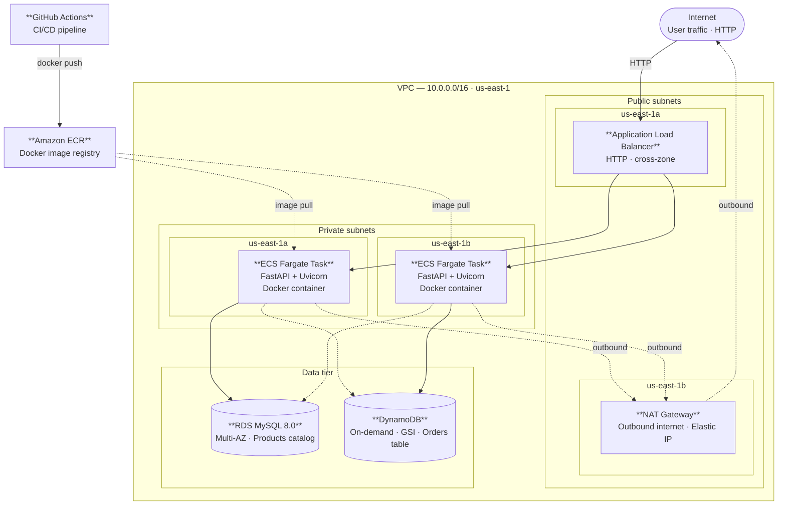

# AWS Cloud E-Commerce Platform

A production-style e-commerce backend deployed on AWS, built to demonstrate cloud architecture design, containerization, CI/CD pipeline design, and infrastructure-as-code. Key architectural decisions are documented as individual ADRs under [docs/adr/](docs/adr/), with a summary in [docs/architecture-decisions.md](docs/architecture-decisions.md).

## What This Demonstrates

- Designing private, production-style AWS workloads behind a public ALB
- Running containerized APIs on ECS Fargate across multiple Availability Zones
- Choosing RDS MySQL and DynamoDB based on workload access patterns
- Automating deployment with GitHub Actions, ECR, and ECS rolling deployments
- Documenting architecture trade-offs, failure behavior, cost, and production-readiness gaps

---

## Architecture Overview



> Solid arrows = primary request path. Dashed arrows = outbound egress (NAT), cross-zone reads, or image pulls.
>
> Full editable diagram: [`docs/aws-ecommerce-architecture.drawio`](docs/aws-ecommerce-architecture.drawio)

ECS Fargate tasks run in private subnets and are only reachable through the ALB. Container images are stored in Amazon ECR and deployed automatically via GitHub Actions on every push to `main`.

---

## CI/CD Pipeline

### Default: Single Environment (push to main)

```
Developer pushes to main branch
        |
        v
GitHub Actions: deploy.yml
        |-- Run Tests (pytest)
        +-- Build and Deploy to ECS
                |-- docker build
                |-- docker push to ECR
                +-- ECS rolling deployment to production
```

### Optional: Dual Environment with Approval Gate (push to staging)

```
Developer pushes to staging branch
        |
        v
GitHub Actions: deploy-staging.yml
        |-- Run Tests (pytest)
        |-- Build and Push to ECR
        |-- Auto deploy to ECS staging
        |-- Manual approval gate (GitHub Environment protection)
        +-- Auto deploy to ECS production (after approval)
```

See [docs/environments.md](docs/environments.md) for how to activate the dual-environment workflow.

---

## Tech Stack

| Layer | Technology | Purpose |
|-------|-----------|---------|
| Infrastructure | Terraform | All AWS resources managed as code |
| Network | VPC, public/private subnets, NAT Gateway | Network isolation |
| Compute | ECS Fargate x2 tasks | Serverless containers, no OS management |
| Container Registry | Amazon ECR | Docker image storage with lifecycle policies |
| CI/CD | GitHub Actions | Automated test, build, and deploy pipeline |
| Load Balancer | Application Load Balancer | Traffic distribution, health checks |
| Relational DB | RDS MySQL 8.0 Multi-AZ | Product catalogue with ACID transactions |
| NoSQL DB | DynamoDB (on-demand) | Order storage with GSI |
| API | FastAPI + Uvicorn | REST endpoints |
| Secrets | AWS SSM Parameter Store | DB credentials injected at runtime |
| Monitoring | CloudWatch Logs + Auto Scaling | Container logs, CPU-based scaling (2-4 tasks) |
| IAM | ECS Task Role + Execution Role | Least-privilege access |
| Load Testing | Locust | Performance validation |

---

## API Endpoints

| Method | Path | Description | Storage |
|--------|------|-------------|---------|
| GET | `/health` | ALB health check | -- |
| GET | `/products` | List all products | RDS MySQL |
| POST | `/products` | Create a product | RDS MySQL |
| GET | `/products/{id}` | Get a product by ID | RDS MySQL |
| POST | `/orders` | Place an order | DynamoDB |
| GET | `/orders/{user_id}` | Get orders by user | DynamoDB GSI |

Interactive API docs available at `http://<ALB_DNS>/docs` after deployment.

API documentation preview: [E-Commerce API - Swagger UI](docs/swagger-ui.pdf)

---

## Architecture Decisions

Every decision is documented as an individual ADR in [`docs/adr/`](docs/adr/):

| ADR | Decision | Status |
|-----|----------|--------|
| [ADR-001](docs/adr/adr-001-compute-ecs-fargate-vs-ec2.md) | ECS Fargate vs EC2 for compute | Accepted |
| [ADR-002](docs/adr/adr-002-database-rds-vs-dynamodb.md) | RDS MySQL for products, DynamoDB for orders | Accepted |
| [ADR-003](docs/adr/adr-003-cicd-single-vs-dual-environment.md) | Single vs dual CI/CD environment strategy | Accepted |
| [ADR-004](docs/adr/adr-004-secrets-ssm-parameter-store.md) | SSM Parameter Store for secrets management | Accepted |
| [ADR-005](docs/adr/adr-005-network-public-private-subnets.md) | Public/private subnet separation | Accepted |

**Why ECS Fargate instead of EC2?**
Fargate eliminates OS management overhead and integrates cleanly with ECR and GitHub Actions. A `git push` triggers a full rolling deployment without SSH, CodeDeploy, or manual restarts. See ADR-001.

**Why RDS MySQL with Multi-AZ?**
Product data is relational and benefits from ACID transactions. Multi-AZ provides automatic failover to a standby replica in a second Availability Zone, giving high availability with zero manual intervention. See ADR-002.

**Why DynamoDB for orders?**
Orders are write-heavy and have a flexible schema because each order can contain a variable number of items. DynamoDB on-demand billing avoids idle capacity cost and scales without manual capacity planning. See ADR-002.

**Why two CI/CD strategies?**
Single-environment deployment suits small teams and fast iteration. Dual-environment with an approval gate suits production workloads with real users or compliance requirements. Both are maintained in the repo so clients can choose based on their needs. See ADR-003.

**Why SSM Parameter Store for secrets?**
DB credentials are encrypted at rest and injected into containers at startup via the ECS task execution role. Nothing sensitive is hardcoded in task definitions or committed to the repository. See ADR-004.

---

## Load Test Results

50 concurrent users, ~3 minutes duration.

| Metric | Value |
|--------|-------|
| Total requests | 3,315 |
| Requests/sec (RPS) | ~22 |
| Failure rate | **0%** |
| Median response time | 100 ms |
| 95th percentile | 470 ms |
| Peak response time | 698 ms |

These results validate the demo architecture under controlled load. They are not intended to represent production capacity limits; production sizing would require longer-duration testing, realistic traffic patterns, and database connection monitoring.

---

## Project Structure

```
aws-ecommerce-platform/
|-- app/
|   |-- main.py                    # FastAPI application
|   +-- requirements.txt           # Python dependencies
|-- tests/
|   |-- test_api.py                # Functional smoke tests
|   +-- locustfile.py              # Locust load test
|-- docs/
|   |-- adr/                           # Architecture Decision Records
|   |   |-- adr-001-compute-ecs-fargate-vs-ec2.md
|   |   |-- adr-002-database-rds-vs-dynamodb.md
|   |   |-- adr-003-cicd-single-vs-dual-environment.md
|   |   |-- adr-004-secrets-ssm-parameter-store.md
|   |   +-- adr-005-network-public-private-subnets.md
|   |-- architecture-decisions.md      # ADR index and summary
|   |-- demo-walkthrough.md            # Step-by-step demo guide
|   |-- environments.md                # How to switch between environments
|   |-- failure-scenarios.md           # Expected failure behavior and validation
|   +-- production-readiness.md        # What changes before going to production
|-- .github/
|   +-- workflows/
|       |-- deploy.yml             # Default: push to main -> production
|       +-- deploy-staging.yml     # Optional: staging -> approval -> production
|-- Dockerfile                     # Multi-stage build
|-- main.tf                        # Terraform provider + VPC data sources
|-- variables.tf                   # Input variable declarations
|-- outputs.tf                     # Output values (ALB DNS, ECR URL, etc.)
|-- aurora.tf                      # RDS MySQL instance + subnet group
|-- compute.tf                     # ALB, NAT Gateway
|-- ecs.tf                         # ECS Fargate - cluster, service, task, ECR, IAM
|-- ecs-staging.tf                 # ECS Fargate - staging environment
|-- dynamodb.tf                    # DynamoDB orders table + GSI
|-- security_group.tf              # Three-tier security group model
|-- terraform.tfvars.example       # Template - copy to terraform.tfvars
+-- .gitignore                     # Excludes secrets and state files
```

---

## Prerequisites

- AWS account with IAM user credentials configured (`aws configure`)
- Terraform >= 1.0
- Docker Desktop
- Python >= 3.8 (for local testing)
- A VPC with public and private subnets in `us-east-1`

---

## Deployment

```bash
# 1. Clone the repository
git clone https://github.com/qw486759/aws-ecommerce-platform.git
cd aws-ecommerce-platform

# 2. Create your variable file
cp terraform.tfvars.example terraform.tfvars
# Edit terraform.tfvars and set db_password

# 3. Store DB password in SSM Parameter Store
aws ssm put-parameter \
  --name "/ecommerce/db_password" \
  --value "your-db-password" \
  --type SecureString \
  --region us-east-1

# 4. Initialize Terraform
terraform init

# 5. Preview changes
terraform plan

# 6. Deploy (takes ~15 minutes - RDS Multi-AZ is the slowest step)
terraform apply

# 7. Push the first Docker image to ECR
aws ecr get-login-password --region us-east-1 | \
  docker login --username AWS --password-stdin \
  <account-id>.dkr.ecr.us-east-1.amazonaws.com

docker build -t ecommerce-app .
docker tag ecommerce-app:latest \
  <account-id>.dkr.ecr.us-east-1.amazonaws.com/ecommerce-app:latest
docker push \
  <account-id>.dkr.ecr.us-east-1.amazonaws.com/ecommerce-app:latest

# 8. Test the API
curl http://<ALB_DNS_from_output>/health
curl http://<ALB_DNS_from_output>/products

# 9. Destroy all resources when done
terraform destroy
```

After the first deployment, all subsequent code changes are deployed automatically via GitHub Actions on every push to `main`.

---

## GitHub Actions Setup

Add the following secrets in your repo under **Settings > Secrets and variables > Actions**:

| Secret | Value |
|--------|-------|
| `AWS_ACCESS_KEY_ID` | IAM user access key |
| `AWS_SECRET_ACCESS_KEY` | IAM user secret key |

---

## Cost Estimate (demo run)

| Resource | Cost |
|----------|------|
| NAT Gateway | ~$0.045/hr |
| RDS MySQL Multi-AZ (db.t3.micro) | ~$0.034/hr |
| ECS Fargate x2 tasks | ~$0.012/hr |
| ALB | ~$0.018/hr |
| DynamoDB (on-demand) | ~$0.00 idle |
| **Total (single environment)** | **~$2.5/day** |
| **Total (dual environment)** | **~$3.8/day** |

A typical demo run (deploy, test, destroy in 2-3 hours) costs under **$1 USD**.

---

## Security Notes

- `terraform.tfvars` is git-ignored - never commit it.
- DB credentials are stored in SSM Parameter Store and injected at container startup, never hardcoded.
- RDS is not publicly accessible; only ECS tasks in the same VPC can connect.
- ECS tasks run in private subnets with no public IP assigned.
- IAM roles follow least privilege: the ECS execution role can pull images and read required SSM parameters, while the task role grants only the runtime permissions the application needs, such as DynamoDB access.
